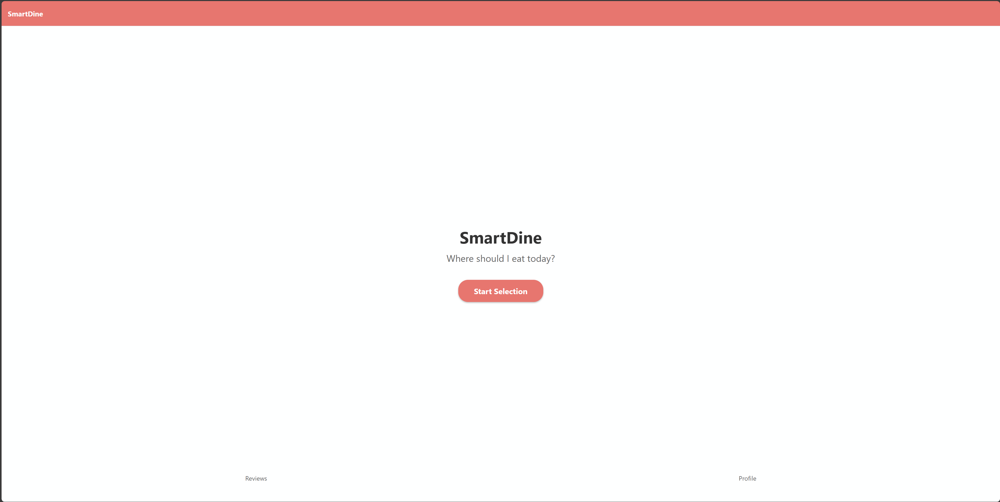
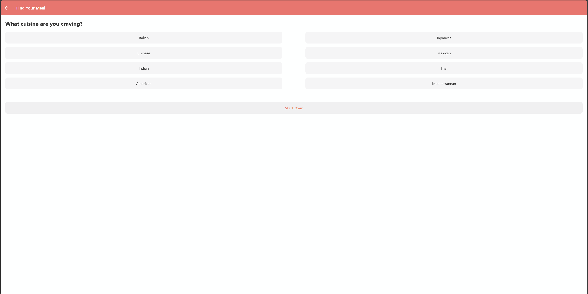
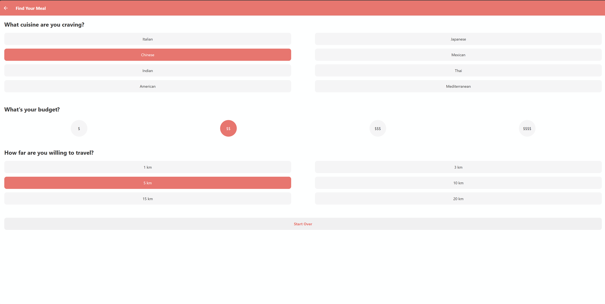
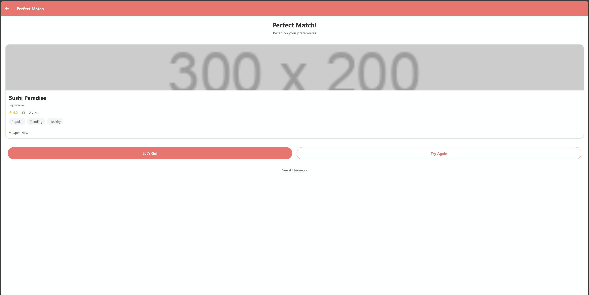
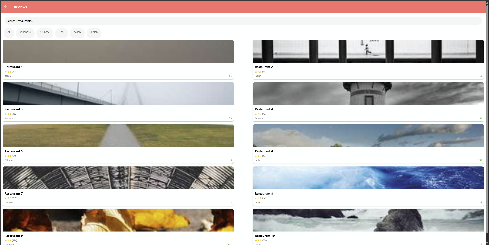
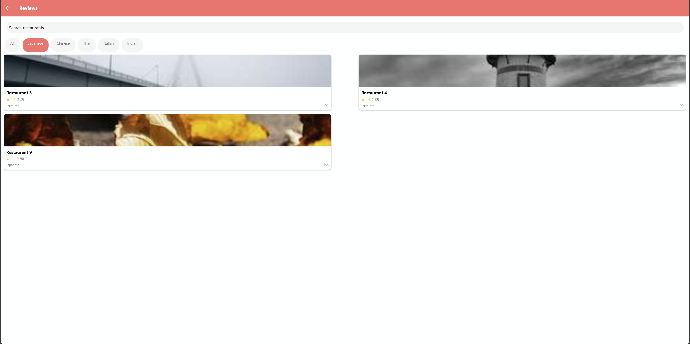
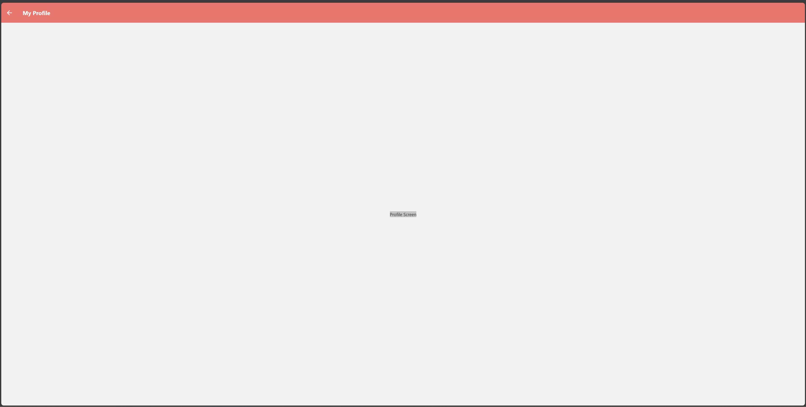
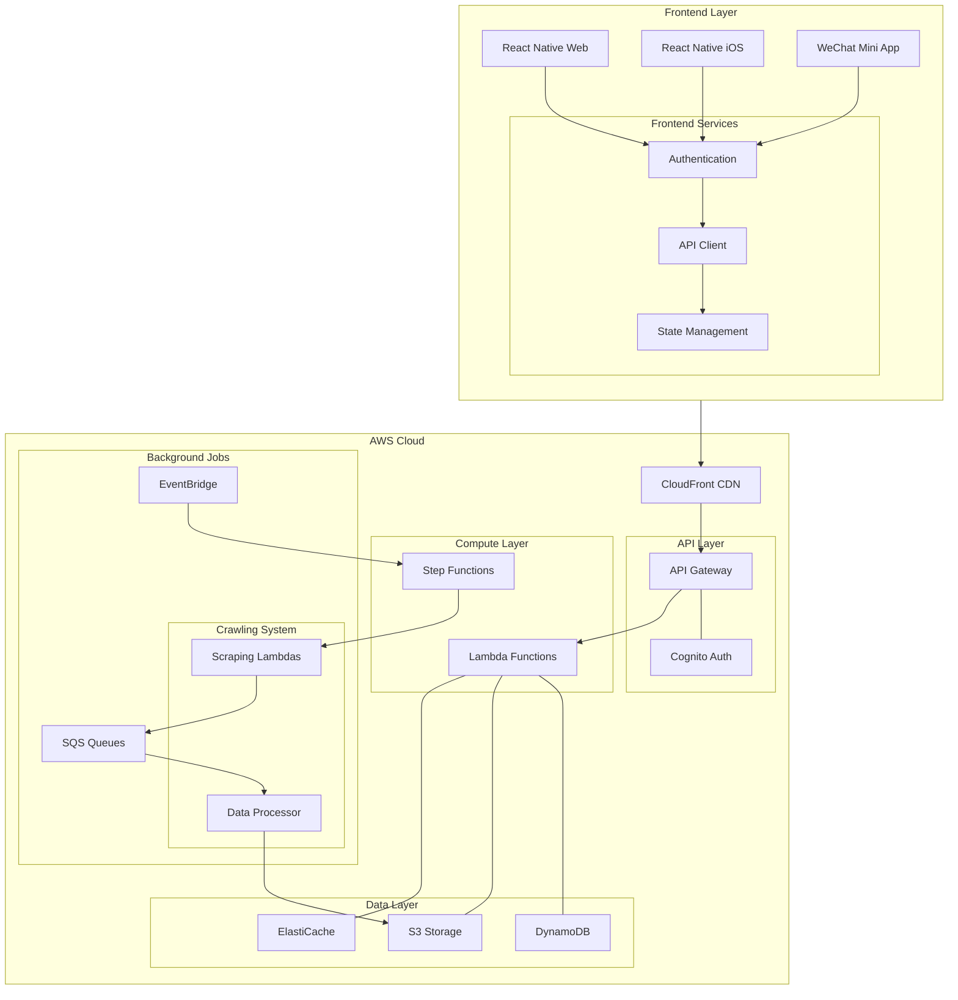
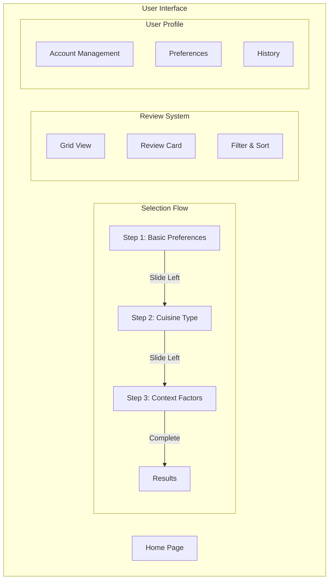

# SmartDine: Intelligent Meal Decision System  

## **Overview**  
**SmartDine** is an AI-powered restaurant recommendation system designed to simplify the question of *"Where should I eat?"* It dynamically collects and analyzes restaurant information, such as reviews, menus, and third-party data, to label restaurants with custom attributes. Users can customize preferences through an intuitive, step-by-step selection process to get highly personalized recommendations.

---

## **Key Features**  
1. **Interactive Meal Selection Flow**
   - Three-step selection process with animated transitions
   - Each step presents one key question with visual choice options
   - Questions include:
     - *Dietary Preferences (Meat/Veg)*
     - *Cuisine Type (Chinese/Thai/Japanese/Korean/Pizza/BBQ)*
     - *Contextual Factors (Temperature/Distance/Time/Price/Ambiance/Spice Level)*
   - Random selection option available at each step
   - Smooth left-swipe transitions between questions
   - Maximum 3 selections for quick decision-making

   ### Screenshots:
   #### Home Screen
   
   
   #### Selection Flow
   
   
   

2. **Restaurant Review & Rating System**
   - Grid-style layout similar to Yelp
   - Visual-first approach with restaurant photos
   - User ratings and detailed reviews
   - Filter and sort capabilities
   - Interactive review cards with expandable details

   ### Screenshots:
   #### Reviews Grid
   
   
   #### Filtered Reviews
   

3. **User Profile & Preferences**
   - Personal account management
   - Customizable dining preferences
   - Review history and favorites
   - Dietary restrictions and preferences storage
   - Account settings and notifications

   ### Screenshots:
   #### Profile Page
   
   
   #### Preferences Settings
   

4. **Dynamic Restaurant Labeling**  
   - Collects reviews and metadata from Google Maps, Yelp, and other third-party platforms.  
   - Uses AI/NLP to label restaurants with attributes like:  
     - *Is the food oily?*  
     - *How busy is the restaurant during holidays?*  
     - *Average dining time (fast or slow)?*  

5. **Customizable Decision Trees**  
   - Users can input specific conditions like:  
     - Weather preferences (hot meals for cold weather).  
     - Dietary goals (low-calorie, healthy options).  
     - Time constraints (fast lunch, slow dinner).  

6. **AI-Powered Recommendation Engine**  
   - Personalized restaurant ranking based on user preferences and past feedback.  
   - Integrates scores from user ratings and historical restaurant performance.  

7. **Data Aggregation**  
   - Combines real-time restaurant data, customer reviews, and menus to generate insights.  
   - Efficient data crawling ensures up-to-date recommendations.

---

## **System Architecture**  



## **Communication Flow**

1. **Frontend to Backend Communication**:
   - All frontend apps use a unified API client library
   - Requests flow through CloudFront CDN for caching and edge optimization
   - API Gateway handles request routing and throttling
   - Cognito manages authentication/authorization

2. **Data Flow**:
   - Real-time requests handled by Lambda functions
   - Heavy computations managed by Step Functions
   - ElastiCache provides caching layer for frequent queries
   - DynamoDB stores user data and processed restaurant information
   - S3 stores raw crawled data and static assets

3. **Background Processing**:
   - EventBridge triggers scheduled crawling jobs
   - Step Functions orchestrate the crawling workflow
   - SQS queues manage crawling tasks
   - Data Processor enriches raw data with AI/ML processing

## **Key Components Interaction**

1. **Frontend Apps**:
   ```typescript
   // Unified API Client
   class APIClient {
     async getRecommendations(preferences: UserPreferences): Promise<Restaurant[]>
     async updateUserProfile(profile: UserProfile): Promise<void>
     async submitFeedback(feedback: Feedback): Promise<void>
   }
   ```

2. **API Layer**:
   ```python
   # FastAPI Backend
   @app.get("/recommendations")
   async def get_recommendations(preferences: UserPreferences):
       restaurants = await recommendation_service.get_recommendations(preferences)
       return restaurants
   ```

3. **Data Processing**:
   ```python
   # Lambda Function
   def process_restaurant_data(event, context):
       raw_data = s3.get_object(event['raw_data_location'])
       processed_data = ai_processor.analyze(raw_data)
       dynamodb.put_item(processed_data)
   ```

## **Technology Stack**

### Frontend
- **Web & iOS**: React Native + Expo
  - React Native Web for browser support
  - Expo for iOS deployment
- **WeChat Mini App**: Taro Framework
  - Allows React-style development
  - Compiles to native WeChat Mini App

### Backend (Serverless)
- AWS Lambda + API Gateway
- FastAPI (Python) for API development
- AWS Step Functions for workflow orchestration
- Amazon EventBridge for scheduling
- Amazon SQS for job queues
- Amazon S3 for data storage
- Amazon DynamoDB for user data and preferences

### Data Processing
- **Crawling**: Python (Scrapy/Selenium)
- **AI Processing**: 
  - OpenAI GPT for restaurant attribute labeling
  - Custom rule-based systems for basic classification
  - Caching layer for optimization
- **Data Storage**: 
  - S3 for raw data
  - DynamoDB for processed data

### DevOps
- Docker for local development
- AWS CDK for infrastructure as code
- GitHub Actions for CI/CD

## **Core Modules**
1. **Data Crawling Module**

Scrapes restaurant reviews, menus, and attributes from:
- Google Maps
- Yelp
- TripAdvisor

2. **AI Data Processor**

Applies NLP (Natural Language Processing) to analyze reviews and extract restaurant features like:
- Oiliness
- Crowdedness
- Dining speed

3. **Decision Tree Engine**

Filters and ranks restaurants based on user-defined parameters (weather, health goals, time).

4. **Recommendation Engine**

Dynamically scores restaurants and provides personalized suggestions.

5. **User Feedback System**

Allows users to rate restaurants and fine-tune future recommendations.

## **Technologies Used**    
- Backend: Python, Flask/FastAPI
- NLP Models: GPT, SpaCy, or custom transformers
- Web Scraping: Scrapy, BeautifulSoup, Selenium
- Data Storage: PostgreSQL, SQLite
- Frontend: React.js / Vue.js
- APIs: Google Maps API, Yelp API, or similar
- Deployment: Docker\

## **Future Roadmap**
- Integrate weather APIs for real-time weather-based recommendations.
- Enhance NLP models to provide deeper insights from reviews.
- Implement user profiles for persistent preference storage.
- Add restaurant reservation features via external APIs.    

## **Contributing**
Contributions are welcome! Fork the repository, make changes, and submit a pull request.

## **License**
This project is licensed under the MIT License.

## **Contact**
For any inquiries or issues, contact rayc9823@gamil.com.

## **AWS Migration Path**
1. **Initial Setup**:
   - Containerize all services using Docker
   - Use environment variables for configuration
   - Implement repository pattern for data access

2. **Gradual Migration**:
   - Start with stateless services on Lambda
   - Migrate data to S3 and DynamoDB
   - Replace cron jobs with EventBridge
   - Convert workflows to Step Functions

3. **Final Phase**:
   - Move API Gateway
   - Implement CloudFront for static assets
   - Set up monitoring with CloudWatch

## **Project Structure**
```
smartdine/
├── frontend/
│   ├── web/                    # React Native Web
│   │   ├── src/
│   │   └── package.json
│   ├── mobile/                 # React Native iOS
│   │   ├── src/
│   │   └── package.json
│   └── wechat/                 # WeChat Mini App
│       ├── src/
│       └── project.config.json
│
├── backend/
│   ├── api/                    # FastAPI Application
│   │   ├── src/
│   │   │   ├── routes/
│   │   │   ├── services/
│   │   │   ├── models/
│   │   │   └── utils/
│   │   ├── tests/
│   │   └── requirements.txt
│   │
│   └── workers/               # Background Workers
│       ├── crawlers/
│       │   ├── google_maps/
│       │   ├── yelp/
│       │   └── tripadvisor/
│       └── processors/
│           ├── ai_labeler/
│           └── data_enrichment/
│
├── infrastructure/            # AWS CDK Infrastructure
│   ├── lib/
│   │   ├── api-stack.ts
│   │   ├── frontend-stack.ts
│   │   └── worker-stack.ts
│   └── bin/
│
└── shared/                   # Shared Code/Types
    ├── types/
    └── constants/
```

## **Setup Instructions**

1. **Frontend Setup**
```bash
# Web/iOS Setup
cd frontend/web
npm install
cd ../mobile
npm install

# WeChat Setup
cd ../wechat
npm install -g @tarojs/cli
taro init
```

2. **Backend Setup**
```bash
# API Setup
cd backend/api
python -m venv venv
source venv/bin/activate  # or `venv\Scripts\activate` on Windows
pip install -r requirements.txt

# Workers Setup
cd ../workers
python -m venv venv
source venv/bin/activate
pip install -r requirements.txt
```

3. **Infrastructure Setup**
```bash
cd infrastructure
npm install
npm run cdk bootstrap
```

## **Development Workflow**

1. **Local Development**
```bash
# Start Frontend (Web)
cd frontend/web
npm run dev

# Start Backend API
cd backend/api
uvicorn main:app --reload

# Start Local DynamoDB
docker-compose up -d
```

2. **Testing**
```bash
# Frontend Tests
cd frontend/web
npm test

# Backend Tests
cd backend/api
pytest
```

3. **Deployment**
```bash
# Deploy Infrastructure
cd infrastructure
cdk deploy --all
```

## **Key Configuration Files**

1. **Docker Compose** (docker-compose.yml)
```yaml
version: '3.8'
services:
  dynamodb-local:
    image: amazon/dynamodb-local
    ports:
      - "8000:8000"
  
  redis-cache:
    image: redis:alpine
    ports:
      - "6379:6379"
```

2. **Backend Environment** (.env)
```env
AWS_REGION=us-east-1
STAGE=development
OPENAI_API_KEY=your_key_here
```

3. **Frontend Environment** (.env)
```env
REACT_APP_API_URL=http://localhost:8000
REACT_APP_STAGE=development
```

## **Frontend Architecture**



## **User Interface Components**

1. **Selection Flow Pages**
   - Circular selection buttons with icons
   - Progress indicator (1/3, 2/3, 3/3)
   - "Feeling Lucky" random option
   - Smooth slide-out animations
   - Clear, single-question focus

2. **Review Grid System**
   - Responsive grid layout
   - Image-centric review cards
   - Quick-view ratings
   - Filter sidebar
   - Sort dropdown menu

3. **Profile Management**
   - Clean, intuitive settings layout
   - Preference management cards
   - History timeline view
   - Account security section

## **Interaction Design**

1. **Selection Process**
   ```typescript
   interface SelectionStep {
     question: string;
     options: Array<{
       icon: string;
       label: string;
       value: string;
     }>;
     randomOption: boolean;
   }

   const steps: SelectionStep[] = [
     {
       question: "What type of food today?",
       options: [
         { icon: "🥩", label: "Meat", value: "meat" },
         { icon: "🥬", label: "Vegetarian", value: "veg" }
       ],
       randomOption: true
     },
     // More steps...
   ];
   ```

2. **Review Component**
   ```typescript
   interface ReviewCard {
     restaurantName: string;
     rating: number;
     images: string[];
     preview: string;
     tags: string[];
     priceRange: string;
   }
   ```

3. **User Preferences**
   ```typescript
   interface UserPreferences {
     dietaryRestrictions: string[];
     favoriteCuisines: string[];
     pricePreference: string;
     locationRadius: number;
     spicePreference: string;
   }
   ```